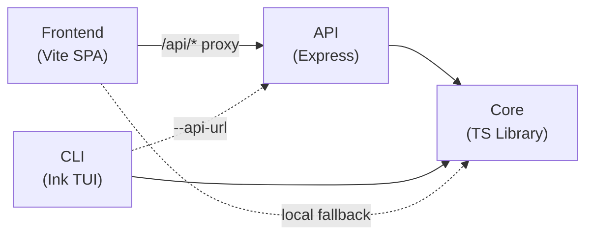
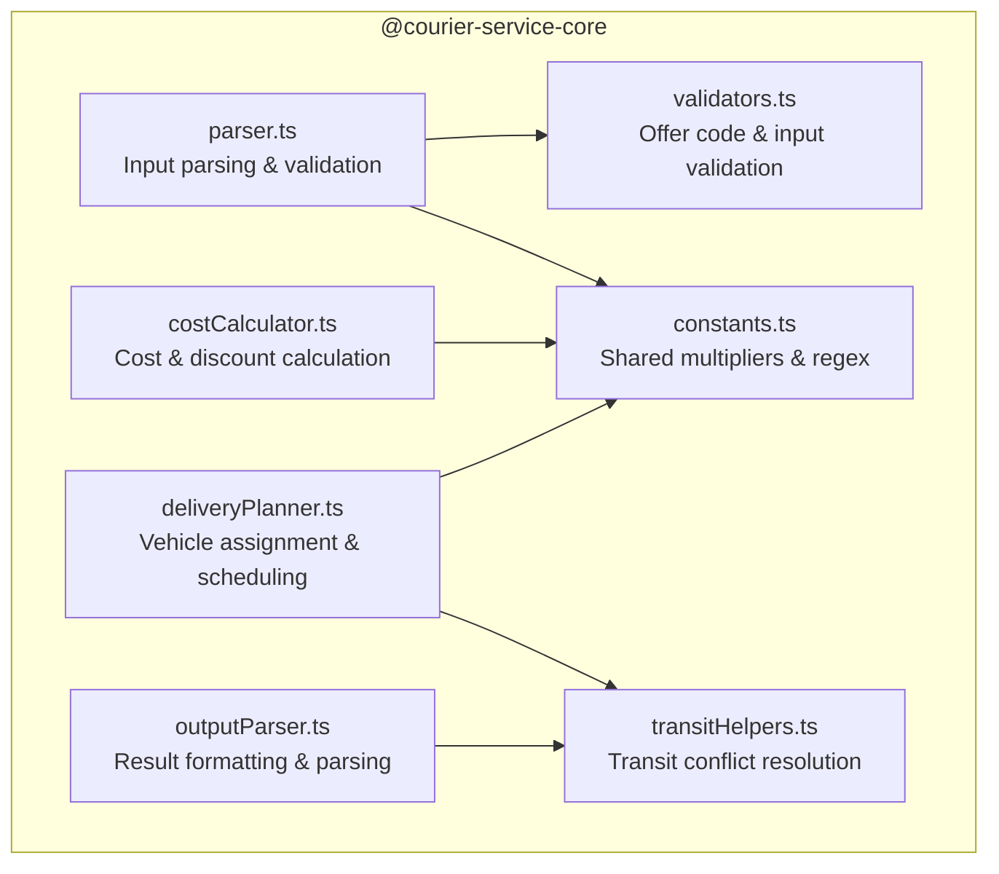
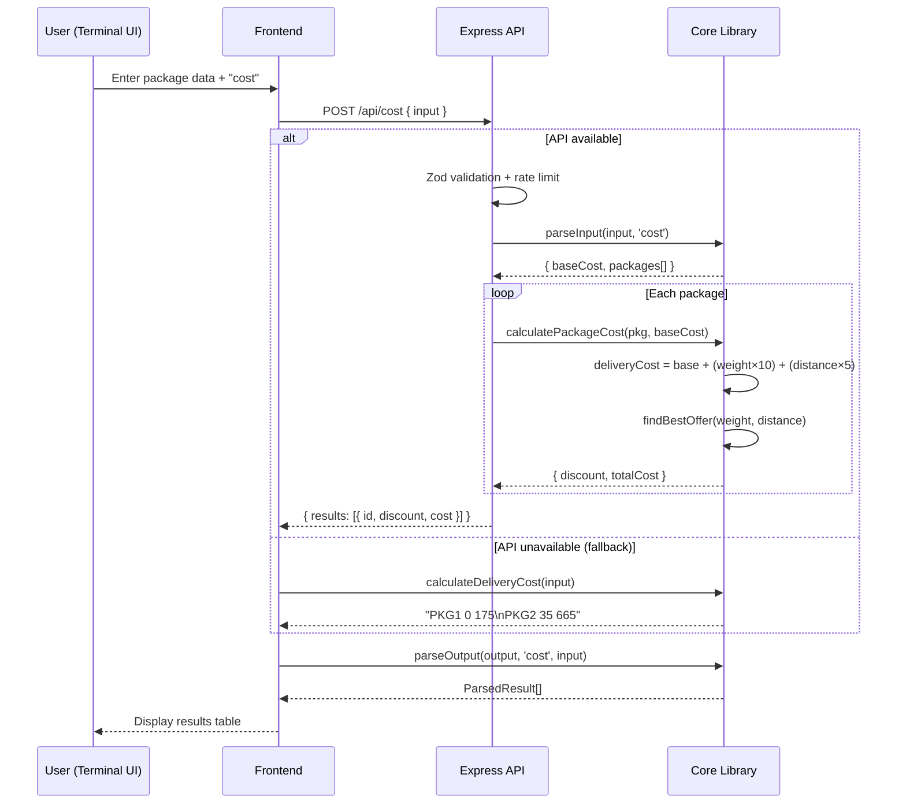
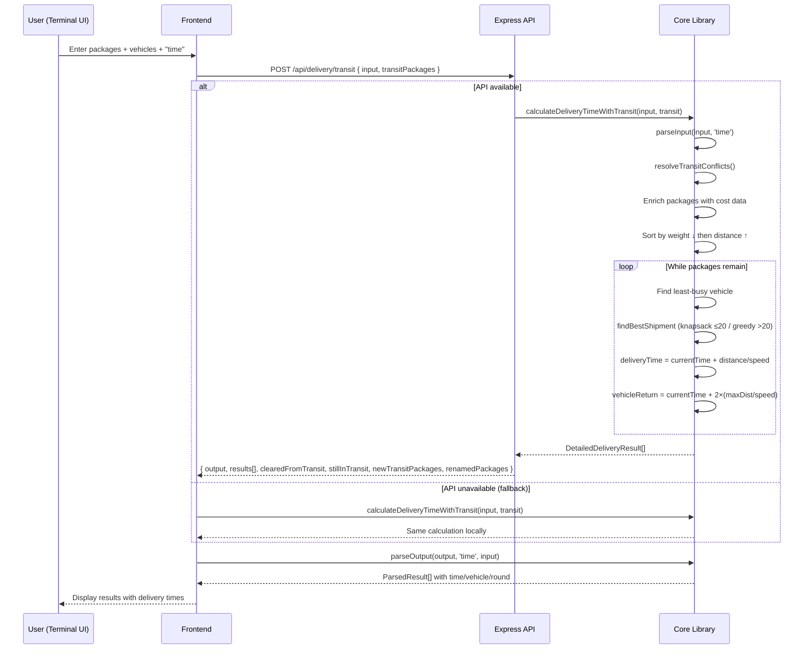
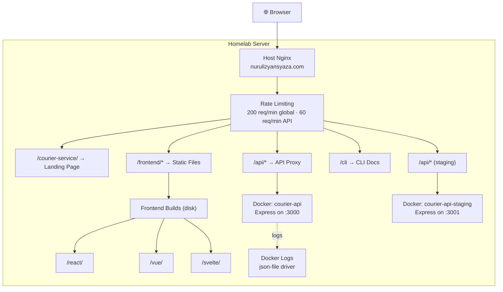
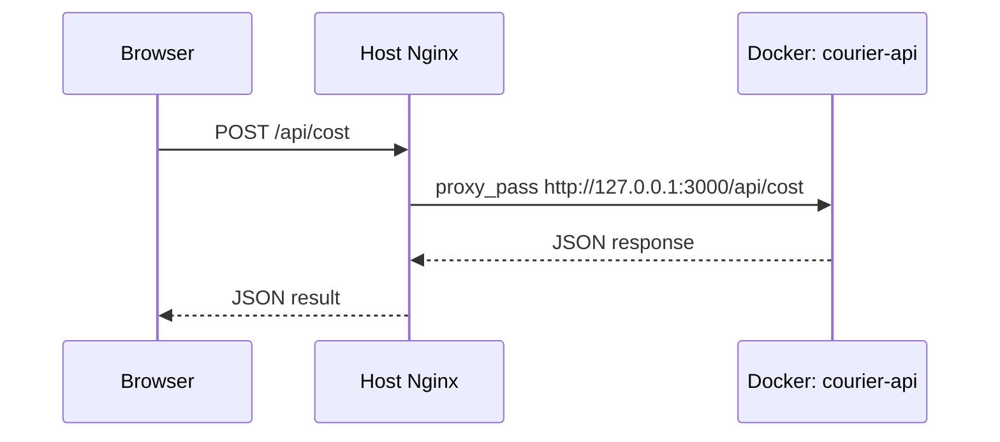

# Courier Service

Orchestration repo for the **Courier Service** App Calculator. Ties together the core library, CLI app, Express API and frontend dashboard with CI/CD, Docker and homelab deployment.

## Architecture

```
courier-service/          ← this repo (CI/CD + Docker + Homelab infra)
courier-service-core/     ← NPM package: cost, offers, shipment planning (147 tests)
courier-service-cli/      ← Interactive CLI with Ink TUI (124 tests)
courier-service-api/      ← Express REST API with security middleware (33 tests)
courier-service-frontend/ ← React/Vue/Svelte dashboard with API integration (257 tests)
```

### How They Connect



- **Frontend → API → Core**: Primary path. API provides rate limiting, validation, and security headers.
- **Frontend → Core**: Fallback when API is unreachable. Calculations run client-side.
- **CLI → API → Core**: CLI tries API first (default `http://localhost:3000`), falls back to local core.
- **CLI → Core**: With `--local` flag, CLI skips API and runs calculations directly via core.
- **CLI theme**: Forces a dark terminal background and uses a fixed dark color palette, ensuring consistent rendering regardless of the user's terminal theme (local, Docker, SSH). Background is restored to default on exit.
- **Multi-line input**: Both CLI and frontend support Shift+Enter for new lines. Smart Enter auto-adds a new line when the header declares more packages than currently entered. The frontend's `❯` prompt tracks the cursor line within multi-line input. Arrow keys navigate between lines mid-input and only trigger history navigation on the first/last line.

### Core Library Modules



### Cost Calculation Flow



### Delivery Time Calculation Flow



### Homelab Production Architecture



**Endpoints** — served from homelab at `nurulizyansyaza.com`:

| Environment | Landing Page | Frontend | API | Health Check |
|---|---|---|---|---|
| **Production** | `courier-service.nurulizyansyaza.com/` | `/react/` | `/api/*` | `/api/health` |
| **Staging** | `staging-courier-service.nurulizyansyaza.com/` | `/react/` | `/api/*` | `/api/health` |

### API Proxy via Nginx

The frontend uses `/api/*` URLs for API calls. The host Nginx proxies to the Docker API container:



Configuration:
- **Host Nginx reverse proxy** to Docker containers (prod :3000, staging :3001)
- **Nginx is not containerized** — it runs on the host, serving the personal site and project routes
- **No caching** on `/api/*` — API responses are never cached
- **Rate limiting** — 60 req/min on API routes, 200 req/min global
- If API container is unhealthy, Nginx returns 502
