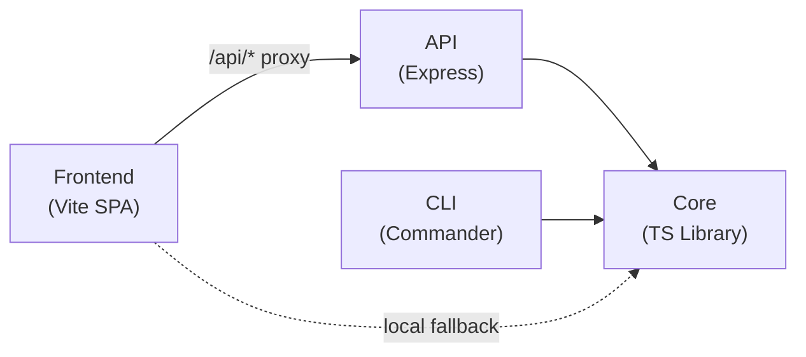
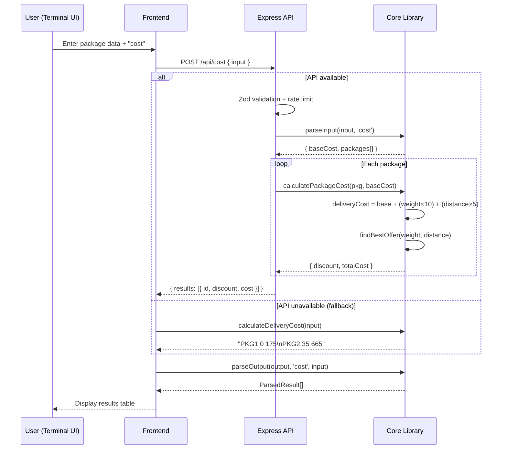
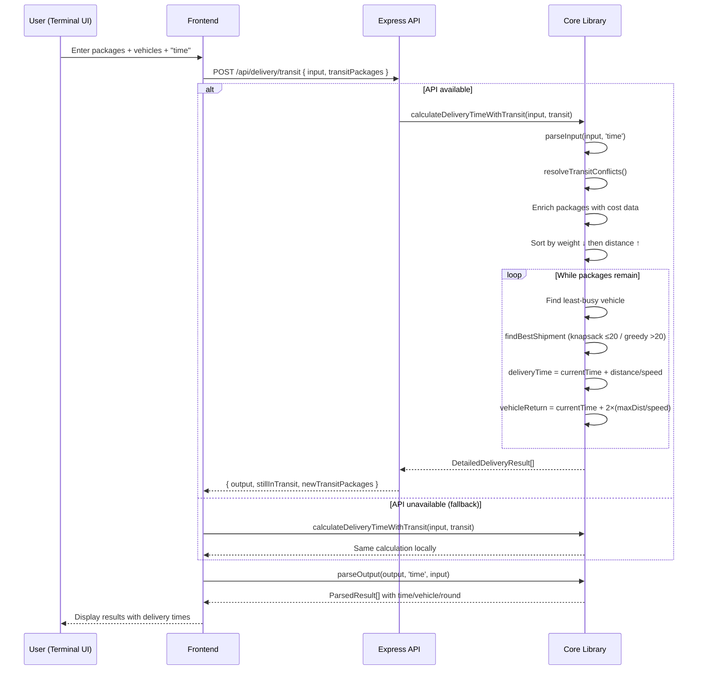
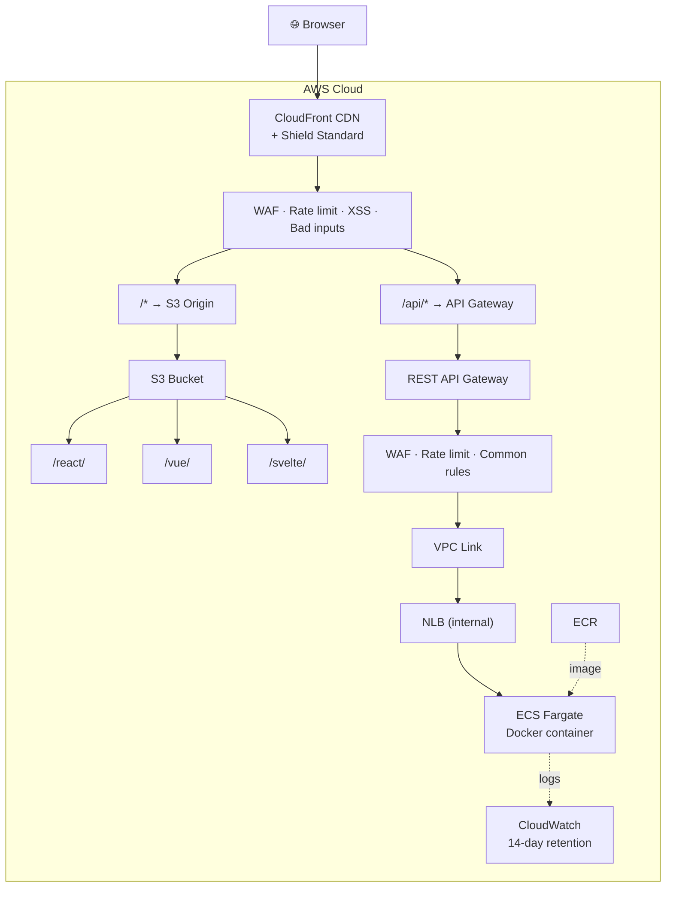
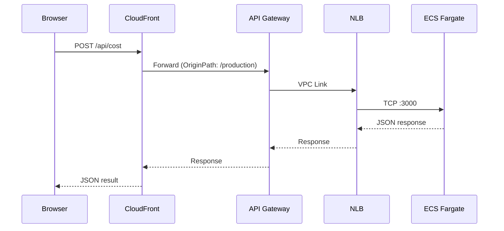
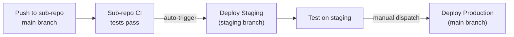

# Courier Service

Orchestration repo for the **Courier Service** App Calculator. Ties together the core library, CLI app, Express API and frontend dashboard with CI/CD, Docker and AWS deployment.

## Architecture

```
courier-service/          ← this repo (CI/CD + Docker + AWS infra)
courier-service-core/     ← NPM package: cost, offers, shipment planning
courier-service-cli/      ← CLI app consuming the core package
courier-service-api/      ← Express REST API with security middleware
courier-service-frontend/ ← React/Vue/Svelte dashboard with API integration
```

### How They Connect



- **Frontend → API → Core**: Primary path. API provides rate limiting, validation, and security headers.
- **Frontend → Core**: Fallback when API is unreachable. Calculations run client-side.
- **CLI → Core**: Standalone. CLI reads stdin and outputs results directly.

### Cost Calculation Flow



### Delivery Time Calculation Flow



### AWS Staging / Production Architecture



**Endpoints** — no custom domain; all use AWS-generated URLs:

| Environment | Frontend | API (direct) | API (via CloudFront) |
|---|---|---|---|
| **Production** | [`d31r5a2wvtwynh.cloudfront.net`](https://d31r5a2wvtwynh.cloudfront.net) | `r7b86qfm3h.execute-api.ap-southeast-1.amazonaws.com/production` | `d31r5a2wvtwynh.cloudfront.net/api/*` |
| **Staging** | [`d28gbmf77bx81u.cloudfront.net`](https://d28gbmf77bx81u.cloudfront.net) | `r7b86qfm3h.execute-api.ap-southeast-1.amazonaws.com/staging` | `d28gbmf77bx81u.cloudfront.net/api/*` |

### API Proxy via CloudFront

The frontend uses relative `/api/*` URLs for API calls. CloudFront proxies these requests to API Gateway, so the same relative URLs work identically in development (Vite proxy) and production (CloudFront proxy):



Configuration:
- **ApiGatewayDomain** parameter passed to `frontend-stack.yml` during deploy
- **CachingDisabled** policy on `/api/*` — API responses are never cached
- **AllViewerExceptHostHeader** origin request policy — forwards all headers except Host
- If no API Gateway domain is provided, the proxy origin is skipped (conditional via `HasApiGateway`)

## Setup

Clone all repos into the same parent directory:

```bash
mkdir courier-service-project && cd courier-service-project
git clone https://github.com/nurulizyansyaza/courier-service.git
git clone https://github.com/nurulizyansyaza/courier-service-core.git
git clone https://github.com/nurulizyansyaza/courier-service-cli.git
git clone https://github.com/nurulizyansyaza/courier-service-api.git
git clone https://github.com/nurulizyansyaza/courier-service-frontend.git
```

Install and build:

```bash
cd courier-service-core && npm ci && npm run build && cd ..
cd courier-service-cli && npm ci && cd ..
cd courier-service-api && npm ci && npm run build && cd ..
cd courier-service-frontend && npm ci && cd ..
```

## Docker

All environments (local, staging, production) use the same multi-stage Dockerfile.

```bash
# Build (from project root containing all repos)
docker build -f courier-service/Dockerfile -t courier-service .

# Run API server
docker run -p 3000:3000 courier-service

# Run CLI - Problem 1
printf '100 3\nPKG1 5 5 OFR001\nPKG2 15 5 OFR002\nPKG3 10 100 OFR003\n' | \
  docker run -i --entrypoint node courier-service courier-service-cli/bin/courier-service cost

# Run CLI - Problem 2
printf '100 5\nPKG1 50 30 OFR001\nPKG2 75 125 OFR008\nPKG3 175 100 OFR003\nPKG4 110 60 OFR002\nPKG5 155 95 NA\n2 70 200\n' | \
  docker run -i --entrypoint node courier-service courier-service-cli/bin/courier-service delivery
```

### Docker Compose

```bash
docker compose up courier-api              # Start API server on port 3000
printf '...' | docker compose run courier-service cost   # Run CLI
```

### Docker Image Details

| Stage | Base | Purpose |
|-------|------|---------|
| Build | `node:20-alpine` | Install deps, compile TypeScript for core, CLI, and API |
| Runtime | `node:20-alpine` | Production deps only + compiled JS. ~60MB image |

The runtime image includes:
- `EXPOSE 3000` — API port
- `HEALTHCHECK` — `wget` to `/api/health` every 30s
- `CMD` — defaults to running the API server
- `NODE_ENV=production`

## AWS Deployment

### Prerequisites

1. **AWS CLI** installed and configured (`aws configure`)
2. **Docker** running locally (for building/pushing images)
3. **GitHub Secrets** set on the `courier-service` repo:
   - `AWS_ACCESS_KEY_ID`
   - `AWS_SECRET_ACCESS_KEY`

### Step 1: Deploy Infrastructure

Creates all AWS resources (S3, CloudFront, VPC, ECS, NLB, REST API Gateway, WAF):

```bash
cd courier-service
./scripts/deploy-infra.sh production
```

This deploys two CloudFormation stacks:
- `courier-frontend-production` — S3 + CloudFront + WAF + API proxy origin
- `courier-api-production` — ECR + VPC + ECS Fargate + NLB + REST API Gateway + WAF

### Step 2: Deploy API

Builds the Docker image, pushes to ECR, and updates the ECS service:

```bash
./scripts/deploy-api.sh production
```

### Step 3: Deploy Frontend

Builds all 3 frameworks (React, Vue, Svelte) and uploads to S3:

```bash
./scripts/deploy-frontend.sh production
```

### Frontend Framework Switching

All three frameworks (React, Vue, Svelte) are deployed simultaneously to S3 and served via CloudFront:

```
https://d31r5a2wvtwynh.cloudfront.net/react/   ← React build
https://d31r5a2wvtwynh.cloudfront.net/vue/     ← Vue build
https://d31r5a2wvtwynh.cloudfront.net/svelte/  ← Svelte build
```

A **CloudFront Function** handles SPA routing — rewriting non-asset paths (e.g. `/react/some-path`) to the framework's `index.html`. The root URL (`/`) redirects to the default framework (configured via `DefaultFramework` parameter).

**Framework switching is per-user**: each user types `use vue` or `use svelte` in their terminal UI, which navigates their browser to `/<framework>/`. Other users are unaffected.

### CI/CD Deployment

**Production** (this branch) — manual only via `workflow_dispatch`:

```bash
gh workflow run deploy-production.yml --ref main -f deploy_target=all
```

This deploys to separate CloudFormation stacks (`courier-frontend-production`, `courier-api-production`) on the same AWS account as staging. All sub-repos are checked out from their `main` branch.

1. Runs all tests (core, CLI, API, frontend)
2. Deploys/updates CloudFormation stacks
3. Builds and pushes Docker image to ECR
4. Updates ECS Fargate service
5. Builds all 3 frontend frameworks (with `--base=/<framework>/`) and uploads to S3
6. Invalidates CloudFront cache

**Staging** — lives on the `staging` branch. Sub-repo CI auto-triggers staging deploys (from sub-repo `main` branches) via `gh workflow run`. Once staging is verified, merge `staging` → `main` and deploy production manually. See the staging branch README for details.

### AWS Services Used

| Service | Purpose | Cost |
|---------|---------|------|
| **S3** | Frontend static hosting (React/Vue/Svelte builds) | Free tier: 5GB |
| **CloudFront** | CDN + HTTPS for frontend | Free tier: 1TB/mo |
| **API Gateway** | REST API proxy to ECS via VPC Link + NLB | Free tier: 1M calls/mo |
| **ECS Fargate** | Serverless Docker container for API | ~$0.04/hr (0.25 vCPU) |
| **ECR** | Docker image registry | Free tier: 500MB |
| **NLB** | Network load balancer for ECS tasks (internal) | Free tier: 750 hrs/mo |
| **WAF** | Rate limiting + managed rules (XSS, bad inputs) | ~$5/mo per WebACL |
| **Shield Standard** | DDoS protection on CloudFront | Free |
| **CloudWatch Logs** | Container logs (14-day retention) | Free tier: 5GB |

### Infrastructure Files

```
infra/
  cloudformation/
    frontend-stack.yml   # S3 + CloudFront + CloudFront Function (SPA routing) + API proxy origin + WAF
    api-stack.yml        # ECR + VPC + ECS Fargate + NLB + REST API Gateway + WAF (REGIONAL)
  env/
    production.env       # Production config (region, stack names, default framework)
scripts/
  deploy-infra.sh        # Deploy/update CloudFormation stacks
  deploy-api.sh          # Build Docker → push ECR → update ECS
  deploy-frontend.sh     # Build all frameworks (--base=/<fw>/) → S3 → invalidate CloudFront
  switch-framework.sh    # Legacy: switch framework via CloudFront origin path
```

## CI/CD

GitHub Actions workflow (`.github/workflows/ci.yml`) runs on push/PR:

1. **test-core** — installs and tests `courier-service-core` (Node 18 + 20)
2. **test-cli** — installs core + CLI, runs CLI tests (Node 18 + 20)
3. **test-api** — installs core + API, runs API tests (Node 18 + 20)
4. **test-frontend** — type-checks, tests, and builds the frontend (Node 20)
5. **test-system** — verifies CLI Problem 1/2 outputs and API cost endpoint

Production deployment (`.github/workflows/deploy-production.yml`) — manual `workflow_dispatch` only:

```bash
gh workflow run deploy-production.yml --ref main -f deploy_target=all
```

### Deployment Flow



## Security

### Express Middleware (Application Layer)

| Layer | Protection |
|-------|-----------|
| **Helmet** | Security headers against XSS, clickjacking, MIME sniffing |
| **CORS** | Origin whitelist (localhost dev + CloudFront distributions) |
| **Rate Limiting** | Global: 100 req/15min, Calculations: 30 req/min |
| **Zod Validation** | Schema-based input validation (type safety, length limits) |
| **Body Size Limit** | 100kb max request body |
| **Morgan** | HTTP request logging |

### AWS Infrastructure (Network Layer)

| Layer | Protection |
|-------|-----------|
| **AWS WAF** | Rate limiting (1000-2000 req/5min per IP), managed rule sets |
| **AWS Shield Standard** | Automatic DDoS protection (free on CloudFront) |
| **CloudFront** | HTTPS-only, TLS 1.2+, HTTP/2+3 |
| **REST API Gateway** | Request throttling, payload size limits, WAF integration |
| **VPC** | Network isolation for ECS tasks, security groups |
| **NLB** | Internal load balancer, no public exposure |
| **ECR Image Scanning** | Vulnerability scanning on push |
| **S3 OAC** | Bucket accessible only via CloudFront (no direct S3 URL) |

## Related Repos

- [courier-service-core](https://github.com/nurulizyansyaza/courier-service-core) — Core logic NPM package
- [courier-service-cli](https://github.com/nurulizyansyaza/courier-service-cli) — CLI application
- [courier-service-api](https://github.com/nurulizyansyaza/courier-service-api) — Express REST API
- [courier-service-frontend](https://github.com/nurulizyansyaza/courier-service-frontend) — Frontend dashboard
