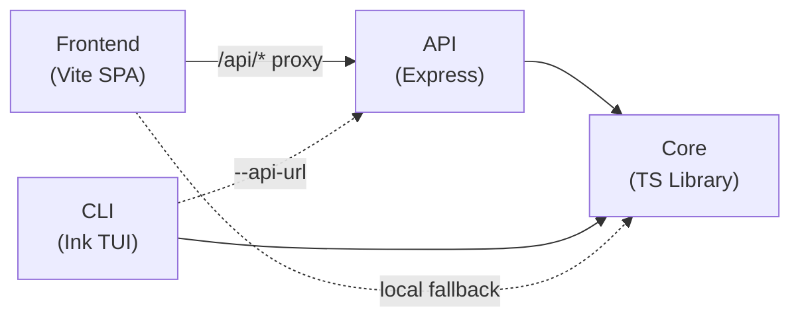
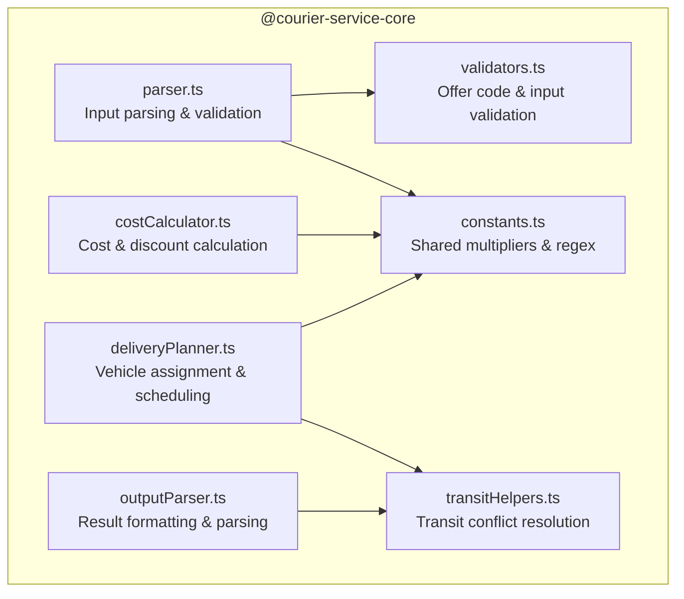
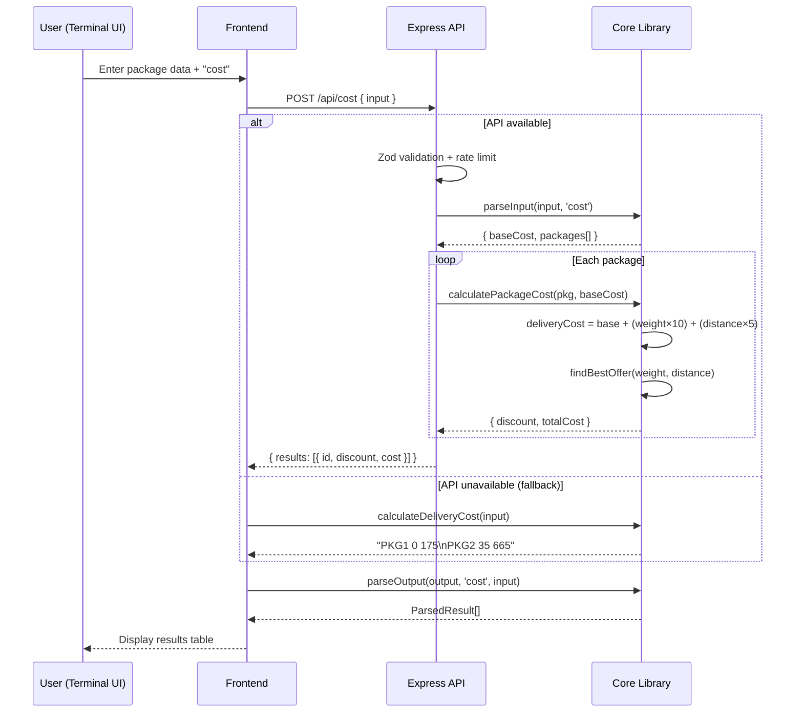
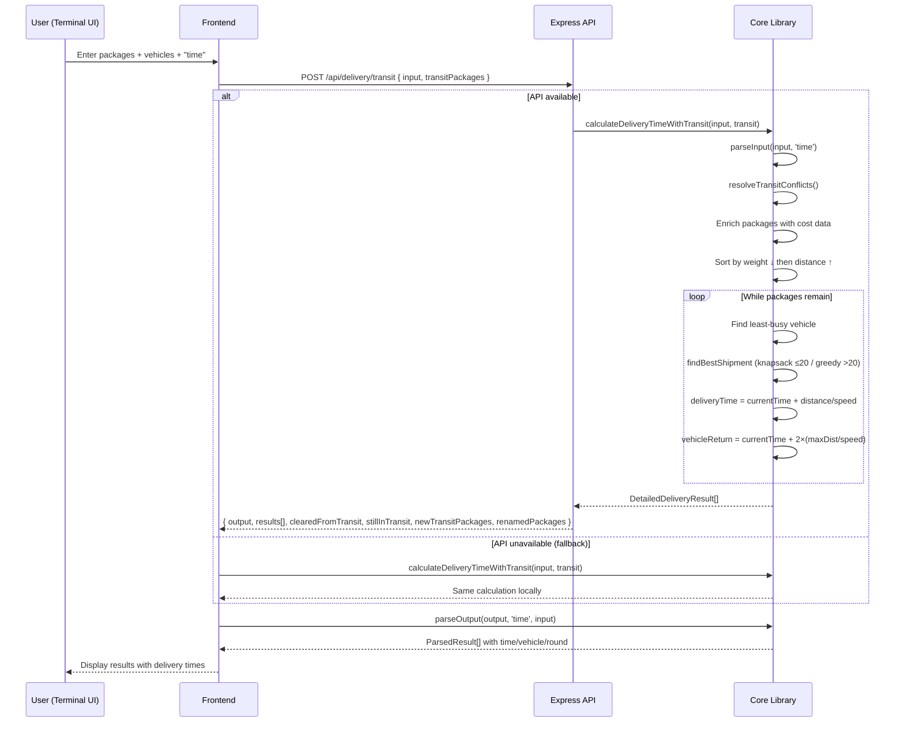
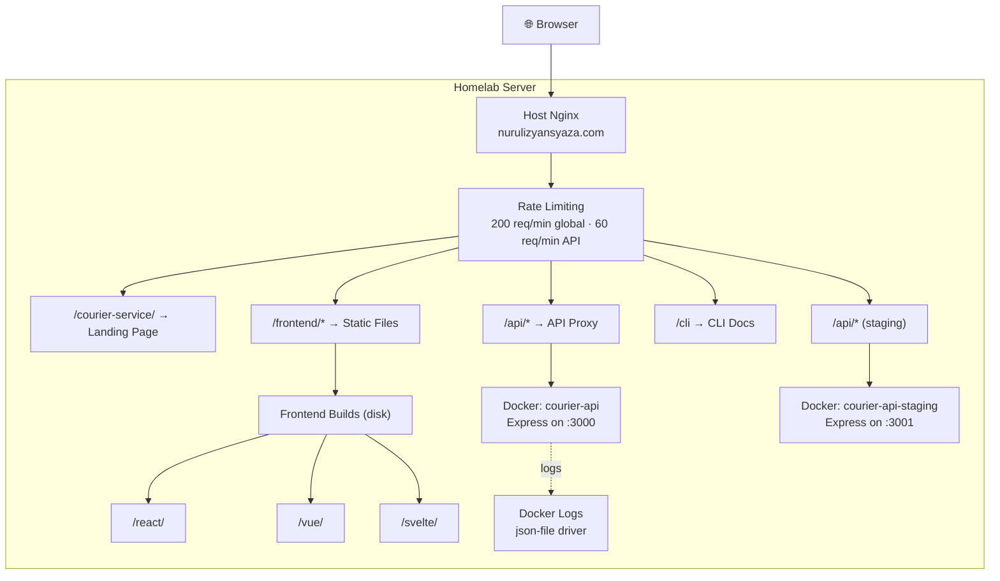
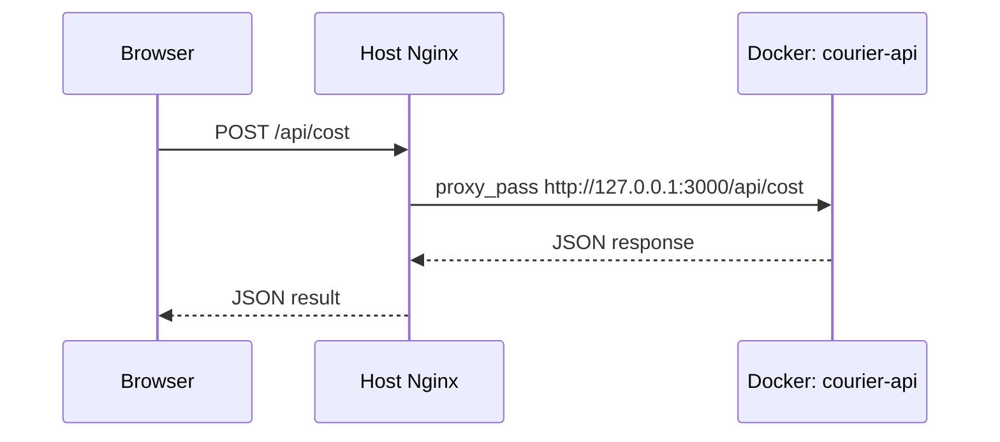
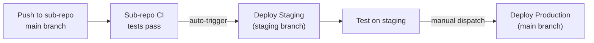

# Courier Service

Orchestration repo for the **Courier Service** App Calculator. Ties together the core library, CLI app, Express API and frontend dashboard with CI/CD, Docker and homelab deployment.

## Architecture

```
courier-service/          ← this repo (CI/CD + Docker + Homelab infra)
courier-service-core/     ← NPM package: cost, offers, shipment planning (147 tests)
courier-service-cli/      ← Interactive CLI with Ink TUI (124 tests)
courier-service-api/      ← Express REST API with security middleware (33 tests)
courier-service-frontend/ ← React/Vue/Svelte dashboard with API integration (257 tests)
```

### How They Connect



- **Frontend → API → Core**: Primary path. API provides rate limiting, validation, and security headers.
- **Frontend → Core**: Fallback when API is unreachable. Calculations run client-side.
- **CLI → API → Core**: CLI tries API first (default `http://localhost:3000`), falls back to local core.
- **CLI → Core**: With `--local` flag, CLI skips API and runs calculations directly via core.
- **CLI theme**: Forces a dark terminal background and uses a fixed dark color palette, ensuring consistent rendering regardless of the user's terminal theme (local, Docker, SSH). Background is restored to default on exit.
- **Multi-line input**: Both CLI and frontend support Shift+Enter for new lines. Smart Enter auto-adds a new line when the header declares more packages than currently entered. The frontend's `❯` prompt tracks the cursor line within multi-line input. Arrow keys navigate between lines mid-input and only trigger history navigation on the first/last line.

### Core Library Modules



### Cost Calculation Flow



### Delivery Time Calculation Flow



### Homelab Production Architecture



**Endpoints** — served from homelab at `nurulizyansyaza.com`:

| Environment | Landing Page | Frontend | API | Health Check |
|---|---|---|---|---|
| **Production** | `courier-service.nurulizyansyaza.com/` | `/react/` | `/api/*` | `/api/health` |
| **Staging** | `staging-courier-service.nurulizyansyaza.com/` | `/react/` | `/api/*` | `/api/health` |

### API Proxy via Nginx

The frontend uses `/api/*` URLs for API calls. The host Nginx proxies to the Docker API container:



Configuration:
- **Host Nginx reverse proxy** to Docker containers (prod :3000, staging :3001)
- **Nginx is not containerized** — it runs on the host, serving the personal site and project routes
- **No caching** on `/api/*` — API responses are never cached
- **Rate limiting** — 60 req/min on API routes, 200 req/min global
- If API container is unhealthy, Nginx returns 502

## Setup

### Prerequisites

| Tool | Version | How to check |
|---|---|---|
| **Node.js** | 18 or 20 (recommended: 20) | `node --version` |
| **npm** | Comes with Node.js | `npm --version` |
| **Git** | Any recent version | `git --version` |
| **Docker** | Any recent version (optional) | `docker --version` |

### Step 1 — Clone all repos

Create a project folder and clone all repos into it:

```bash
mkdir courier-service-project
cd courier-service-project

git clone https://github.com/nurulizyansyaza/courier-service.git
git clone https://github.com/nurulizyansyaza/courier-service-core.git
git clone https://github.com/nurulizyansyaza/courier-service-api.git
git clone https://github.com/nurulizyansyaza/courier-service-cli.git
git clone https://github.com/nurulizyansyaza/courier-service-frontend.git
```

Your folder should now look like:

```
courier-service-project/
├── courier-service/           ← this repo
├── courier-service-core/
├── courier-service-api/
├── courier-service-cli/
└── courier-service-frontend/
```

### Step 2 — Install and build

> **Important:** Build the core library **first** — all other repos depend on it.

```bash
# 1. Core library (must be first)
cd courier-service-core
npm ci
npm run build
cd ..

# 2. API
cd courier-service-api
npm ci
npm run build
cd ..

# 3. CLI
cd courier-service-cli
npm ci
cd ..

# 4. Frontend
cd courier-service-frontend
npm ci
cd ..
```

### Step 3 — Verify it works

```bash
# Run the API
cd courier-service-api && npm run dev &

# Wait a moment, then check the health endpoint
sleep 2 && curl http://localhost:3000/api/health
# Should print: {"status":"ok"}
```

> **See also:** [INTRO.md](INTRO.md) for full step-by-step instructions with example test data and API requests.

## Docker

### Development (with hot-reload)

Start all services with one command — no manual install needed:

```bash
cd courier-service
docker compose -f docker-compose.dev.yml up
```

This starts the core watcher, API (`http://localhost:3000`) and frontend (`http://localhost:5173`) with hot-reload.

```bash
# Run the CLI
docker compose -f docker-compose.dev.yml run --rm cli

# Run all 561 tests
docker compose -f docker-compose.dev.yml run --rm test

# Run tests for a single repo
docker compose -f docker-compose.dev.yml run --rm test-core

# Port conflicts? Change the port
API_PORT=3001 FE_PORT=5174 docker compose -f docker-compose.dev.yml up

# Stop everything
docker compose -f docker-compose.dev.yml down
```

> Source files are mounted as volumes — edit code on your machine and changes are picked up automatically.

### Production

All environments use the same multi-stage Dockerfile:

```bash
# Build from project root (the folder containing all repos)
docker build -f courier-service/Dockerfile -t courier-service .

# Run the API server
docker run -p 3000:3000 courier-service

# Test it
curl http://localhost:3000/api/health

# Run CLI interactively
docker run -it --entrypoint node courier-service courier-service-cli/bin/courier-service --local
```

> **Note:** The CLI needs `-it` flags for interactive terminal UI. For non-interactive usage, use the API endpoints.

### Docker Compose (production)

```bash
docker compose up courier-api              # Start API server on port 3000
docker compose run -it courier-service     # Run CLI interactively
```

### Docker Image Details

| Stage | Base | Purpose |
|-------|------|---------|
| Build | `node:20-alpine` | Install deps, compile TypeScript for core, CLI, and API |
| Runtime | `node:20-alpine` | Production deps only + compiled JS. ~60MB image |

The runtime image includes:
- `EXPOSE 3000` — API port
- `HEALTHCHECK` — `wget` to `/api/health` every 30s
- `CMD` — defaults to running the API server
- `NODE_ENV=production`
- Graceful shutdown on `SIGTERM`/`SIGINT` — closes connections cleanly before container stops

## Homelab Deployment

### Prerequisites

1. **Homelab server** running Docker and Docker Compose, with Nginx installed on the host
2. **SSH access** via Cloudflare Tunnel (`ssh yangedruce@ssh.nurulizyansyaza.com` through `cloudflared`)
3. **Host Nginx** already serving `nurulizyansyaza.com` — the project is added as location blocks
4. **GitHub Secrets** set on the `courier-service` repo:
   - `HOMELAB_SSH_KEY` — SSH private key for the deploy user
   - `HOMELAB_USER` — SSH username (e.g., `yangedruce`)
   - `HOMELAB_HOST` — Cloudflare Tunnel hostname for SSH (e.g., `ssh.nurulizyansyaza.com`)

### Step 1: Setup Infrastructure

Creates the directory structure, copies config files, and static pages to the homelab:

```bash
cd courier-service
./scripts/deploy-infra.sh production
```

This sets up:
- Project directories on the homelab (`/opt/courier-service/`)
- Nginx snippet for sub-path routing (include in host Nginx config)
- Docker Compose production stack
- Static landing page and CLI docs page

### Step 2: Deploy API

Builds the Docker image locally, transfers to homelab, and starts the service:

```bash
./scripts/deploy-api.sh production    # Production (port 3000)
./scripts/deploy-api.sh staging       # Staging (port 3001)
```

### Step 3: Deploy Frontend

Builds all 3 frameworks (React, Vue, Svelte) with sub-path base URLs and uploads to homelab:

```bash
./scripts/deploy-frontend.sh production    # Builds with --base=/frontend/<fw>/
./scripts/deploy-frontend.sh staging       # Builds with --base=/frontend/<fw>/
```

### Frontend Framework Switching

All three frameworks (React, Vue, Svelte) are deployed simultaneously and served via Nginx:

```
https://courier-service.nurulizyansyaza.com/react/    ← React build
https://courier-service.nurulizyansyaza.com/vue/      ← Vue build
https://courier-service.nurulizyansyaza.com/svelte/   ← Svelte build
```

The bare `/` URL redirects to the default framework. To switch:

```bash
./scripts/switch-framework.sh vue production
```

### CI/CD Deployment

**Production** — manual only via `workflow_dispatch`:

```bash
gh workflow run deploy-production.yml --ref main -f deploy_target=all
```

**Staging** — triggered automatically by sub-repo CI, or manually:

```bash
gh workflow run deploy-staging.yml --ref main -f deploy_target=all
```

Both workflows:
1. Run all tests (core, CLI, API, frontend)
2. Build and transfer Docker image to homelab via SSH
3. Build all 3 frontend frameworks (with `--base=/frontend/<fw>/`) and rsync to homelab
4. Reload host Nginx to pick up changes

### Homelab Stack

| Component | Purpose | Replaces (AWS) |
|-----------|---------|----------------|
| **Host Nginx** | Reverse proxy + static files + rate limiting + sub-path routing | CloudFront + S3 + API Gateway + WAF |
| **Docker** | API containers (prod + staging) | ECS Fargate + ECR |
| **Docker Compose** | Service orchestration | CloudFormation |
| **SSH + rsync** | Deployment | AWS CLI + ECR push + S3 sync |
| **Docker logs** | Container logging | CloudWatch Logs |
| **UFW + fail2ban** | Firewall + brute-force protection | AWS Shield + WAF |

### Infrastructure Files

```
infra/
  nginx/
    nginx.conf           # Includable Nginx snippet for sub-path routing
  env/
    production.env       # Production config (domain, paths)
    staging.env          # Staging config
static/
  index.html             # Landing page at /courier-service/
  index-staging.html     # Staging landing page
  cli.html               # CLI docs page at /cli
  cli-staging.html       # Staging CLI docs
scripts/
  deploy-infra.sh        # Initial homelab setup (directory structure, config files)
  deploy-api.sh          # Build Docker → SSH transfer → restart (prod or staging)
  deploy-frontend.sh     # Build all frameworks (--base=/frontend/<fw>/) → rsync
  switch-framework.sh    # Update Nginx default framework redirect + reload
```

## CI/CD

GitHub Actions workflow (`.github/workflows/ci.yml`) runs on push/PR:

1. **test-core** — installs and tests `courier-service-core` (Node 18 + 20, 147 tests)
2. **test-cli** — installs core + CLI, runs CLI tests (Node 18 + 20, 124 tests)
3. **test-api** — installs core + API, runs API tests (Node 18 + 20, 33 tests)
4. **test-frontend** — type-checks, tests, and builds the frontend (Node 20, 257 tests)
5. **test-system** — verifies core library outputs and API cost endpoint

Production deployment (`.github/workflows/deploy-production.yml`) — manual `workflow_dispatch` only:

```bash
gh workflow run deploy-production.yml --ref main -f deploy_target=all
```

Staging deployment (`.github/workflows/deploy-staging.yml`) — auto-triggered by sub-repos or manual:

```bash
gh workflow run deploy-staging.yml --ref main -f deploy_target=all
```

### Deployment Flow



## Security

### Express Middleware (Application Layer)

| Layer | Protection |
|-------|-----------|
| **Helmet** | Security headers against XSS, clickjacking, MIME sniffing |
| **CORS** | Origin whitelist (localhost dev + homelab domain) |
| **Rate Limiting** | Global: 100 req/15min, Calculations: 30 req/min |
| **Zod Validation** | Schema-based input validation (type safety, length limits, all errors returned) |
| **Body Size Limit** | 100kb max request body |
| **Morgan** | HTTP request logging |

### Homelab Infrastructure (Network Layer)

| Layer | Protection |
|-------|-----------|
| **Nginx Rate Limiting** | 200 req/min global, 60 req/min API (per IP) |
| **UFW Firewall** | Allow only ports 22 (SSH), 80 (HTTP), 443 (HTTPS) |
| **fail2ban** | Brute-force SSH protection |
| **Nginx Security Headers** | X-Frame-Options, X-Content-Type-Options, CSP, XSS-Protection |
| **Docker Network** | API containers bound to localhost, only reachable via host Nginx proxy |
| **Gzip Compression** | Reduces bandwidth for static assets |
| **Client Body Limit** | 100kb max request body at Nginx level |

## Shared Dependency Model

All three consumer packages depend on `@nurulizyansyaza/courier-service-core` via `file:../courier-service-core`:

```
courier-service-core (source of truth)
  ├── courier-service-api    → direct import, no fallback needed
  ├── courier-service-cli    → API-first + local core fallback
  └── courier-service-frontend → API-first + local core fallback
```

- **Zero logic duplication** — parsing, cost calculation, delivery planning, transit conflict resolution, and offer validation all live in core
- **Centralized constants** — magic numbers (weight/distance multipliers, package limits) and shared regex patterns defined once in `constants.ts`
- **API-first with fallback** — CLI and frontend try the API first; if unreachable, run the same core functions locally
- When core is updated, all consumers get the changes after `npm ci` / rebuild
- CI builds core first, then runs downstream tests to catch breaking changes

## Related Repos

- [courier-service-core](https://github.com/nurulizyansyaza/courier-service-core) — Core logic NPM package (147 tests)
- [courier-service-cli](https://github.com/nurulizyansyaza/courier-service-cli) — CLI application with Ink TUI (124 tests)
- [courier-service-api](https://github.com/nurulizyansyaza/courier-service-api) — Express REST API with Bruno test collection (33 tests)
- [courier-service-frontend](https://github.com/nurulizyansyaza/courier-service-frontend) — React/Vue/Svelte dashboard (257 tests)
